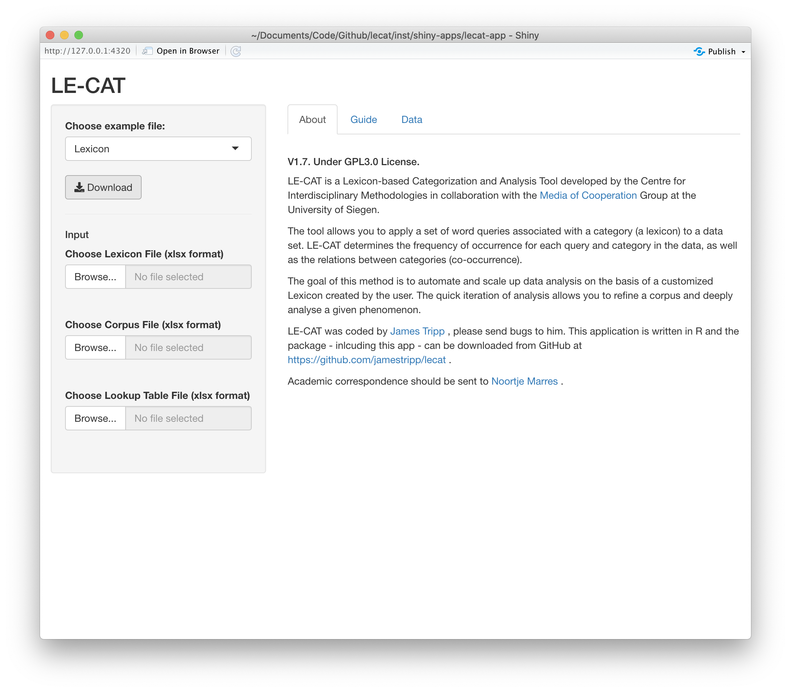
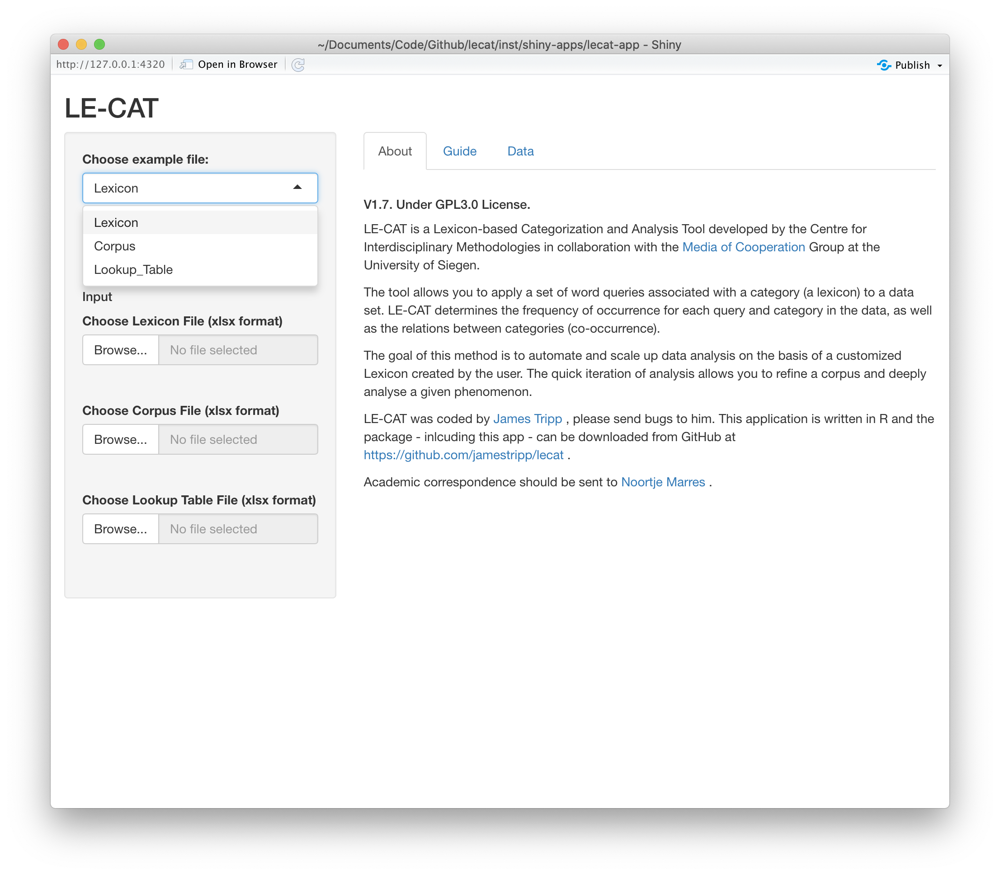
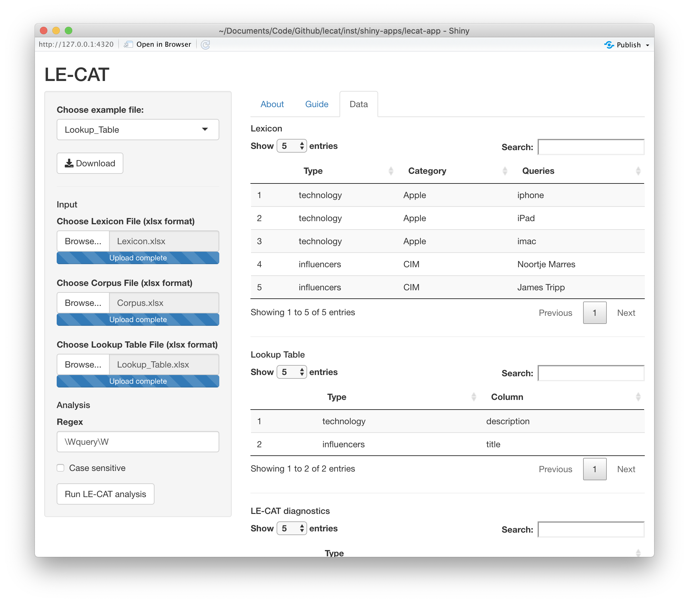
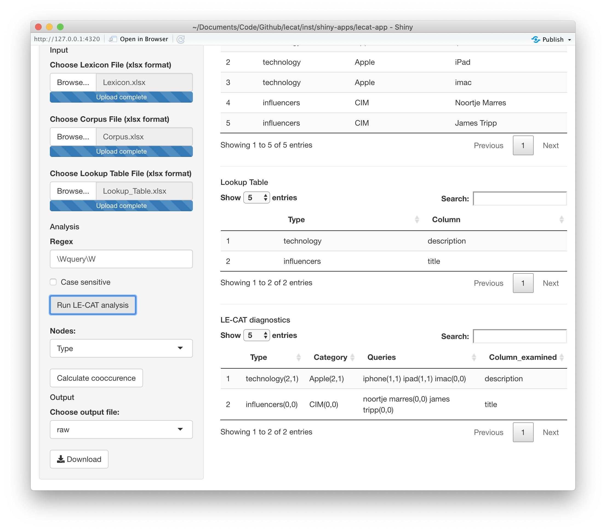

```{r setup, include=FALSE}
knitr::opts_chunk$set(echo = TRUE)
```

The functionality of LE-CAT is available via a Shiny app. The app offers a web based interface to carry out an analysis.

## Launching

To launch the app, run:

``` r
lecat::run_app()
```

the app will launch in a new window. 

## Loading data

On first startup, this is the interface.



LE-CAT requires excel input files with a specific structure. Example files have been provided which you can download by clicking on the drop down, choosing Lexicon, Corpus or Lookup Table and then clicking download for each.



We recomend you download the example files first. Then add your content to these files. LE-CAT requires you to keep the same column names as the example files. Let's consider each file in turn.

### Lexicon

The lexicon file contains the columns Type, Category, Query and then Query1, Query2, etc. You can see this structure in the example lexicon file.

| Type       | Category | Query    | Query1    | Query2 |
| ---------- | -------- | -------- | --------- | ------ |
| technology | Apple | iphone | iPad | imac  |
| influencers | CIM | Noortje Marres | James Tripp | |

In this lexicon, we're searching for queries associated with either Apple or CIM. For example, the queries iphone, iPad and imac correspond to the Apple category. The Type is used in the lookup table file to indicate which column of the corpus to search for the query in.

### Lookup table

In the lexicon we define Types. In the lookup table we tell LE-CAT the column we should look for queries in. Consider our example lookup table.

| Type       | Column |
| ---------- | -------- |
| technology | description | 
| influencers | title | 

The above lookup table instructs LE-CAT to search for queries of the technology type in the description column of the corpus. The lookup table give LE-CAT the flexability to examine multiple columns in one analysis.

### Corpus

The corpus can be comprised of multiple columns with one entry per row. The example lookup table specifies the columns description and title. These are in our example corpus.

| title | description |
|-------|-------------|
| James Tripp talks about LE-CAT | In this iphone and ipad delivered lecture James talks about a new tool. |
| Noortje Marres interview | An interesting interview |
| New iphone | Apple has launched a series of iphones, ipads and imacs. |

## Analysis

Once the Lexicon, Corpus and Lookup Table are loaded a Run LE-CAT Analysis button will be shown.



LE-CAT will start searching for queries once the Run LE-CAT Analysis button is pressed. A progress bar will show indicating the number of queries searched. Once all the queries are searched then you will be shown the result.



The LE-CAT diagnostics tell you the number of unique and total times a query has been found. These are aggregated to indicate the how many unique and total times queries associated with a query were present.

You can also calculate the co-occurence of queries, categories or types in the corpus. To choose the level of co-occurence calculated select Query, Category or Type in the drop down menu under Nodes and click on the Calculate cooccurence button. Once cooccurences have been calculated a graph file can be downloaded.

To download an output file, select the output file type from the dropdown menu under 'Choose output file'. Then click on the download button to save the file.
